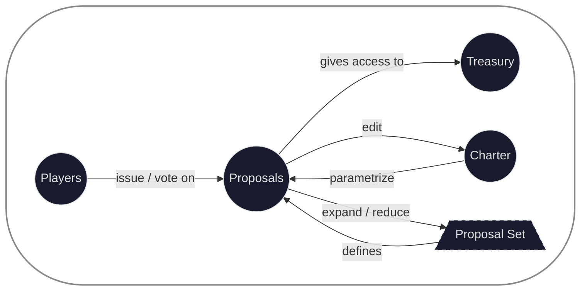

# 01 — Vision: Philosophy and Design Thesis

## The Problem

EVE Frontier's gameplay is built on assemblies — programmable primitives that compose into infrastructure, logistics networks, markets, and industrial systems. These assemblies are designed to be the backbone of player-driven civilization.

But civilization has not emerged.

The bottleneck is not technology. It is organization. Tribes and syndicates lack tooling for:

- **Trust** — There is no on-chain mechanism for a group to codify who can act on its behalf, what authority they hold, or how decisions are made.
- **Ownership** — Assemblies, tokens, and infrastructure have no native model for shared ownership, revenue splits, or collective custody.
- **Delegation** — Organizations cannot subdivide into departments with scoped authority, or federate into alliances with shared goals.
- **Revenue** — There is no framework for funding projects, distributing returns, or incentivizing contribution within and across groups.

Without these primitives, players default to Discord channels and spreadsheets. Trust is implicit, ownership is informal, delegation is manual, and revenue is honor-system. This does not scale. The tribal economy that should precede inter-tribe trade — and ultimately a civilization-scale trading network — cannot form without a substrate for coordination.

---

## The Thesis

**The DAO is the organizational primitive.**

Not a product. Not a voting tool. A *substrate* — the smallest unit of coordinated decision-making that can compose in every direction:

- **Downward** — A DAO spawns SubDAOs as departments with delegated authority, scoped budgets, and controller-managed boards.
- **Upward** — Independent DAOs federate into alliances, pooling resources and coordinating strategy while retaining sovereignty.
- **Laterally** — A single DAO can simultaneously be a SubDAO of one organization, a federation member of another, and a controller of its own SubDAOs.

This composability is not incidental. It is the core design goal. Every organizational form that players might need — from a solo founder's treasury to an interstellar trade federation — should be expressible as a configuration of DAOs connected by capability objects.

**To a DAO, everything is a proposal.** Spending treasury funds, changing the board, amending the charter, joining a federation, spinning out a department, issuing a project token — all of these are typed proposals that flow through the same governance pipeline. The proposal system *is* the permission system. There are no admin keys, no special roles outside of governance, no backdoors. Authority flows exclusively through voted-upon, on-chain actions.

---

## The DAO Atom

A DAO is an atom — the indivisible unit of on-chain organization. Remove any component and it ceases to function. The atom has four parts:

- **Players** — The members who participate in governance. In Board governance, the board members; in other models, the electorate. Players are the only external input to the atom.
- **Proposals** — The nucleus. Every state change flows through a typed proposal: spending funds, editing the charter, adding or removing proposal types, changing the board. Proposals mediate *all* relationships between the other components.
- **Treasury** — The assets under collective custody: coins, NFTs, capability objects, `TreasuryCap`s. Proposals are the only way in or out.
- **Charter** — The constitution. It defines the organization's purpose, rules, and — critically — the governance parameters that shape how proposals behave. The charter parametrizes proposals, and proposals are the only way to amend the charter.

The key insight is the **self-referential loop**: the charter parametrizes proposals, proposals can edit the charter, and proposals can expand or reduce the set of proposal types the DAO recognizes. This circularity is what makes a DAO a *living* organizational unit rather than a static contract. The atom governs itself, amends itself, and defines the boundaries of its own authority.

The outer boundary of the atom maps directly to blast-radius isolation (Pillar 7). Everything inside the circle is the DAO's sovereign domain. Cross-DAO operations — SubDAO control, federation membership, inter-DAO transfers — cross atom boundaries and require governance actions on both sides.

Atoms compose into molecules: a SubDAO hierarchy is a chain of atoms connected by `SubDAOControl` capability edges. A federation is a cluster of atoms connected by `FederationSeat` edges. The atom is always the unit of sovereignty — no matter how many bonds it forms, its internal governance remains its own.

---

## Design Pillars

### 1. Composability over Hierarchy

The original SubDAO spec models a strict top-down tree: controllers own SubDAOs, SubDAOs cannot act upward. This is necessary but insufficient. Real organizations exist in webs of relationships — a logistics guild is simultaneously a department of Tribe A, a member of the Haulers' Alliance, and a controller of its own regional sub-offices.

The protocol must support this by making the DAO a *node in a directed graph*, where edges are capability objects stored in vaults. `SubDAOControl` edges point downward (controller → owned). `FederationSeat` edges point upward (member → federation). The graph is not a tree — it is a DAG with well-defined invariants preventing cycles and conflicts.

### 2. Immutable Governance Model, Mutable State

A DAO's governance type (Board, Direct, Weighted) is sealed at creation. The governance *state* within that type — board members, voter weights, delegate registrations — is mutable through authorized proposals. Changing the governance model requires a full migration via `SpawnDAO`, which creates a successor DAO and transfers all assets. This makes governance predictable: participants always know what kind of organization they are in.

### 3. Charter as Constitution

Every DAO has a Charter — a human-readable document stored on Walrus that defines the organization's purpose, operating agreements, membership rules, and amendment procedures. The Charter is not decorative. It is an on-chain object with a content hash, version history, and a high-threshold amendment process. Constitutional governance means the rules by which the DAO operates are themselves subject to governance.

### 4. Typed Proposals as Permissions

Rather than implementing a separate role-based permission layer, the protocol encodes permissions through typed proposals with per-type governance configurations. A `SendSmallPayment` type with low approval threshold and a `ProposeUpgrade` type with high threshold and long delay encode different permission levels using the same mechanism. SubDAOs scope these permissions to their own treasury and capabilities — an Engineering department's low-threshold `SendCoin` only touches the Engineering budget.

### 5. Hot-Potato Execution Integrity

Every proposal execution produces an `ExecutionRequest` — a hot-potato object that must be consumed by the correct handler in the same Programmable Transaction Block. This guarantees that governance-authorized actions are executed atomically and correctly. Capabilities borrowed from vaults during execution are guaranteed to be returned via `CapLoan` hot potatoes. The type system, not runtime checks, enforces execution integrity.

### 6. Minimal Trust Surface

The only admin-like capability in the system is the `FreezeAdminCap` — a circuit breaker that can temporarily pause specific proposal types for up to a bounded duration. It cannot execute proposals, cannot access the treasury, and cannot change governance. It exists solely to buy time when a vulnerability is discovered. Even this minimal admin power is appointed by governance, replaceable by governance, and auto-expires.

### 7. Blast Radius Isolation

Every DAO has its own `TreasuryVault`, `CapabilityVault`, and `Charter` as separate shared objects. A compromised SubDAO cannot access its controller's treasury. A rogue federation member cannot access other members' vaults. The damage from any single compromise is bounded to the compromised DAO's own assets. Cross-DAO operations require explicit governance actions on both sides.

---

## What This Enables

The protocol is the governance layer. Everything else builds on top:

- **Project funding** — Kickstarter-style campaigns where a project is a SubDAO, backers form the board, and revenue flows through treasury vaults.
- **Markets** — Token issuance with `TreasuryCap` held in DAO vaults and governed by proposals.
- **Logistics** — Hauling services, gate networks, and storage depots operated as DAO-governed infrastructure projects.
- **Inter-tribe trade** — Federations that coordinate trade agreements, shared infrastructure, and dispute resolution across sovereign tribes.
- **Constitutional governance** — Charters that encode operating agreements, with high-threshold amendment processes that protect minority stakeholders.

The DAO protocol does not implement any of these directly. It provides the primitives — governance, treasury, capabilities, composition — from which all of them can be built.

> **Hackathon scope:** The hackathon submission focuses on Board governance, SubDAO hierarchy, charter integration, and EVE Smart Assembly integration. Federation, project funding, and advanced governance models are stretch features. See [07 Roadmap](07_roadmap.md) for phasing and the [stretch features index](stretch/00_index.md) for full design.
