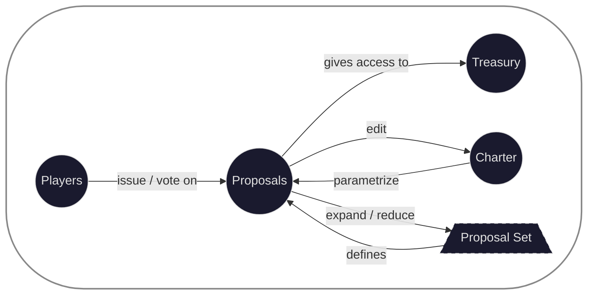

# 01 — Vision: Philosophy and Design Thesis

## The Problem

EVE Frontier's gameplay is built on assemblies — programmable primitives that compose into infrastructure, logistics networks, markets, and industrial systems. These assemblies are designed to be the backbone of player-driven civilization.

But civilization has not emerged.

The bottleneck is not technology. It is organization. Tribes and syndicates lack tooling for:

- **Trust** — There is no on-chain mechanism for a group to codify who can act on its behalf, what authority they hold, or how decisions are made.
- **Ownership** — Assemblies, tokens, and infrastructure have no native model for shared ownership, revenue splits, or collective custody.
- **Delegation** — Organizations cannot subdivide into departments with scoped authority, or federate into alliances with shared goals.
- **Revenue** — There is no framework for funding projects, distributing returns, or incentivizing contribution within and across groups.

Without these primitives, players default to Discord channels and spreadsheets. Trust is implicit, ownership is informal, delegation is manual, and revenue is honor-system. This does not scale. The tribal economy that should precede inter-tribe trade — and ultimately a civilization-scale trading network — cannot form without a substrate for coordination.

---

## The Thesis

**The OU is the organizational primitive.**

Not a product. Not a voting tool. A *substrate* — the smallest unit of coordinated decision-making that can compose in every direction:

- **Downward** — An OU spawns SubOUs as departments with delegated authority, scoped budgets, and controller-managed boards.
- **Upward** — Independent OUs federate into alliances, pooling resources and coordinating strategy while retaining sovereignty.
- **Laterally** — A single OU can simultaneously be a SubOU of one organization, a federation member of another, and a controller of its own SubOUs.

This composability is not incidental. It is the core design goal. Every organizational form that players might need — from a solo founder's treasury to an interstellar trade federation — should be expressible as a configuration of OUs connected by capability objects.

**To an OU, everything is a proposal.** Spending treasury funds, changing the board, updating the charter, joining a federation, spinning out a department, issuing a project token — all of these are typed proposals that flow through the same governance pipeline. The proposal system *is* the permission system: each proposal type holds exactly the permissions governance granted it, and nothing else. There are no admin keys, no special roles outside of governance, no backdoors. Authority flows exclusively through on-chain governance — voted-upon actions, or execution paths a vote explicitly opened (such as a self-join that checks tribe membership).

---

## The OU Atom

An OU is an atom — the indivisible unit of on-chain organization. Remove any component and it ceases to function. The atom has four parts:

```mermaid
graph TD
    subgraph ATOM [" "]
        Players((Players))
        Proposals((Proposals))
        Treasury((Treasury))
        Charter((Charter))
        ProposalSet[/Proposal Set\]

        Players -- "issue / vote on" --> Proposals
        Proposals -- "gives access to" --> Treasury
        Proposals -- "edit" --> Charter
        Charter -- "parametrize" --> Proposals
        Proposals -- "expand / reduce" --> ProposalSet
        ProposalSet -- "defines" --> Proposals
    end

    style ATOM fill:none,stroke:#888,stroke-width:2px,rx:100,ry:100
    style Players fill:#1a1a2e,stroke:#e0e0e0,color:#e0e0e0
    style Proposals fill:#1a1a2e,stroke:#e0e0e0,color:#e0e0e0
    style Treasury fill:#1a1a2e,stroke:#e0e0e0,color:#e0e0e0
    style Charter fill:#1a1a2e,stroke:#e0e0e0,color:#e0e0e0
    style ProposalSet fill:#1a1a2e,stroke:#e0e0e0,color:#e0e0e0,stroke-dasharray:5 5
```

- **Players** — The members who participate in governance. In Board governance, the board members; in other models, the electorate. Players are the only external input to the atom.
- **Proposals** — The nucleus. Every state change flows through a typed proposal: spending funds, editing the charter, adding or removing proposal types, changing the board. Proposals mediate *all* relationships between the other components.
- **Treasury** — The assets under collective custody: coins, multicoin balances, capability objects, `TreasuryCap`s. Anyone can deposit; proposals are the only way out.
- **Charter** — The constitution: the organization's name and a pointer to the document that defines its purpose and rules. Today the parameters that shape how proposals behave live in each proposal type's config; moving them into the charter, so that the charter parametrizes proposals on-chain, is a planned feature ([stretch/10](stretch/10_charter_parametrization.md)). Proposals are the only way to change the charter.

The key insight is the **self-referential loop**: proposals can expand or reduce the set of proposal types the OU recognizes, reconfigure those types (including the ones that do the reconfiguring), and edit the charter. This circularity is what makes an OU a *living* organizational unit rather than a static contract. The atom governs itself, amends itself, and defines the boundaries of its own authority. Safety floors keep the loop from dissolving itself: the types that change the rules require an 80% vote.

The outer boundary of the atom maps directly to blast-radius isolation (Pillar 7). Everything inside the circle is the OU's sovereign domain. Cross-OU operations — SubOU control, federation membership, inter-OU transfers — cross atom boundaries. An atom's assets and authority leave it only by its own governance action (receiving is permissionless), and a controller acts on a SubOU only through the `SubOUControl` it holds.

Atoms compose into molecules: a SubOU hierarchy is a chain of atoms connected by `SubOUControl` capability edges. A federation (planned) is a cluster of atoms connected by `FederationSeat` edges. The atom is always the unit of sovereignty — no matter how many bonds it forms, its internal governance remains its own.

---

## Design Pillars

### 1. Composability over Hierarchy

The original SubOU spec models a strict top-down tree: controllers own SubOUs, SubOUs cannot act upward. This is necessary but insufficient. Real organizations exist in webs of relationships — a logistics guild is simultaneously a department of Tribe A, a member of the Haulers' Alliance, and a controller of its own regional sub-offices.

The protocol must support this by making the OU a *node in a directed graph*, where edges are capability objects stored in vaults. `SubOUControl` edges point downward (controller → owned). `FederationSeat` edges (planned) point upward (member → federation). The graph is not meant to be a tree but a DAG. The framework's creation paths only ever produce trees; keeping the graph acyclic afterwards is a governance rule (see [04 SubOU Hierarchy](04_subdao_hierarchy.md) §7).

### 2. Immutable Governance Model, Mutable State

An OU's governance model is sealed at creation; today Board is the only model. The governance *state* — the board roster — is mutable through authorized proposals, and every change is versioned so a proposal's voters stay fixed at its creation. Changing the governance model would require a full migration via `SpawnOU`, which creates a successor OU and transfers all assets. This makes governance predictable: participants always know what kind of organization they are in.

### 3. Charter as Constitution

Every OU has a Charter — its name and a pointer to a human-readable document that defines the organization's purpose, operating agreements and membership rules. Changing it is a governance action (`UpdateMetadata`), and every change is on the record. A Walrus-backed charter with a content hash, version history and a dedicated amendment process is planned ([05 Charter](05_charter.md) Part B). Constitutional governance means the rules by which the OU operates are themselves subject to governance.

### 4. Typed Proposals as Permissions

Rather than implementing a separate role-based permission layer, the protocol encodes permissions through typed proposals. Each type holds permission bits naming exactly what its execution may touch (add board members, withdraw from the treasury, borrow a named capability type), and its own governance configuration (threshold, quorum, delay, cooldown). Types that hold high-impact bits need an 80% vote; others can run on lighter configs. An `AddMember` type at 50%, a `SendSmallPayment` type capped by a rolling spend limit, and a `ProposeUpgrade` type with a long delay encode different permission levels using the same mechanism. SubOUs scope these permissions to their own treasury and capabilities — an Engineering department's `SendCoin` only touches the Engineering budget.

### 5. Hot-Potato Execution Integrity

Every proposal execution produces an `ExecutionTicket` wrapping an `ExecutionRequest` — hot-potato objects that must be consumed in the same Programmable Transaction Block. Only the module that defines the proposal's payload type can spend or close its ticket, so the approved payload, not the executor, decides the arguments. Every framework mutator checks the request's permission bits. This guarantees that governance-authorized actions are executed atomically, correctly, and only within what the type was granted. Capabilities borrowed from vaults during execution are guaranteed to be returned via `CapLoan` hot potatoes. The type system enforces execution integrity; the permission checks bound its reach.

### 6. Minimal Trust Surface

The only admin-like capability in the system is the `FreezeAdminCap` — a circuit breaker that can temporarily pause specific proposal types for up to a bounded duration. It cannot execute proposals, cannot access the treasury, and cannot change governance. It exists solely to buy time when a vulnerability is discovered. It starts with the OU's creator (or the admin named at creation), governance can transfer it or override its freezes, and every freeze expires on its own.

### 7. Blast Radius Isolation

Every OU has its own `TreasuryVault`, `CapabilityVault`, and `Charter` as separate shared objects, and every gated operation checks that its authorization belongs to the OU it touches. A compromised SubOU cannot access its controller's treasury. A rogue federation member cannot access other members' vaults. The damage from any single compromise is bounded to the compromised OU's own assets (and, for a controller, the SubOUs it controls). Assets and authority leave an OU only through its own governance.

---

## What This Enables

The protocol is the governance layer. Everything else builds on top:

- **Project funding** — Kickstarter-style campaigns where a project is a SubOU, backers form the board, and revenue flows through treasury vaults.
- **Markets** — Token issuance with `TreasuryCap` held in OU vaults and governed by proposals.
- **Logistics** — Hauling services, gate networks, and storage depots operated as OU-governed infrastructure projects.
- **Inter-tribe trade** — Federations that coordinate trade agreements, shared infrastructure, and dispute resolution across sovereign tribes.
- **Constitutional governance** — Charters that encode operating agreements, with high-threshold amendment processes that protect minority stakeholders.
- **Open extension** — Third-party packages define their own proposal types; an OU enables one by an 80% vote and grants it only the permissions its handler needs.

The OU protocol does not implement any of these directly. It provides the primitives — governance, treasury, capabilities, composition — from which all of them can be built.

> **Status:** Implemented: Board governance, the SubOU hierarchy (including one-transaction tribe creation), charter metadata, per-type permissions, composite proposals, execution without a vote for types an OU opts into (including EVE Frontier tribe self-join through `armature_world_bridge`), and treasury, currency and upgrade proposal types. Federation, project funding, Walrus-backed charters, charter parametrization and other governance models are stretch features. See [07 Roadmap](07_roadmap.md) for phasing and the [stretch features index](stretch/00_index.md) for full design.
